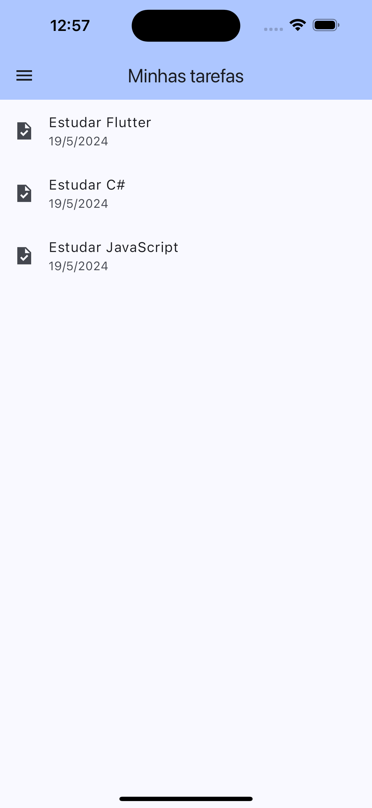

# Projeto para a disciplina "[24E2_2] Desenvolvimento Mobile com Flutter"

Este projeto foi desenvolvido como parte da disciplina "[24E2_2] Desenvolvimento Mobile com Flutter". O objetivo do projeto é criar um aplicativo de tarefas que permite adicionar, visualizar e gerenciar tarefas.

## Funcionalidades

- Adicionar uma nova tarefa
- Visualizar detalhes de uma tarefa
- Editar uma tarefa existente
- Excluir uma tarefa
- Listar todas as tarefas

## Capturas de Tela

### Tela Inicial


### Menu


### Adicionar Nova Tarefa


### Adicionar Tarefa - Adicionar Dados


### Adicionar Tarefa - Adicionar Data


### Adicionar Tarefa


### Detalhes da Tarefa


## Como Executar

1. Clone este repositório:
   ```sh
   git clone https://github.com/seu-usuario/seu-repositorio.git
   ```